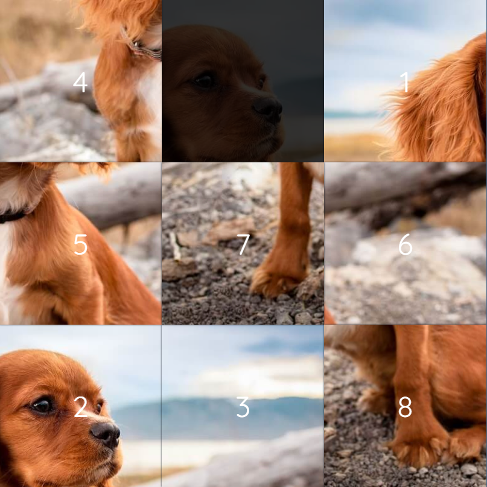

# 8-Puzzle Solver

### This repo is a collection of various Graph Algorithms which can complete an 8-Puzzle.

## **Algorithms Implemented**

- Dijkstra
- Depth First Search
- Breadth First Search

## **To Run**

Select file which's name is the one that you're interested in using.

Setup initial puzzle to represent, for example this one from https://murhafsousli.github.io/8puzzle/#/.

Plug these cordinates into _goal_state_ array. Ex: **goal_array = [1,2,3,4,5,6,7,8,0]**

## Then, **SHUFFLE**

You may get something like this.

### Plug these cordinates into _initial_state_ array. Ex: **initial_array = [4,0,1,5,7,6,2,3,8]**

### Run file and your required moves to win will appear shortly.

---

# :rocket: **ENJOY!** :rocket:
